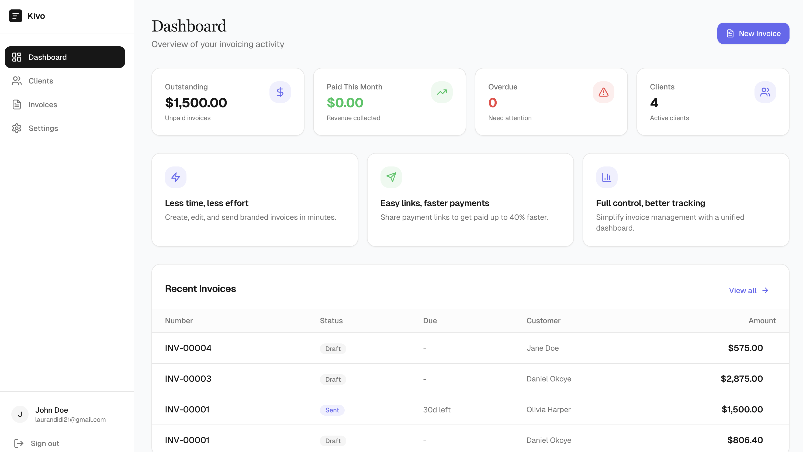
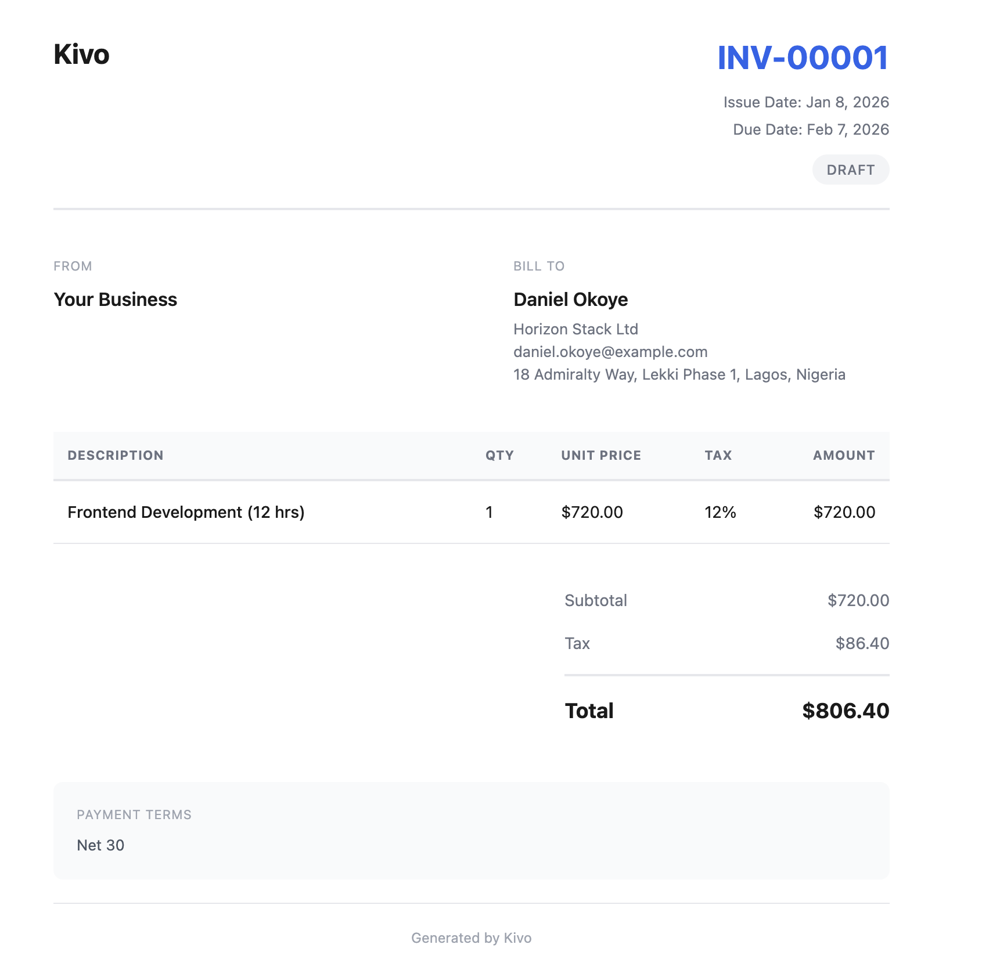

# Kivo

Modern invoicing for freelancers and independent creators. Built on the Cloudflare developer platform.

## Screenshots


*Dashboard with KPIs and recent invoices*


*Invoice detail view with line items and activity*


*Public invoice view with payment option*

## Features

- **Authentication**: Email magic link authentication (passwordless)
- **Multi-tenant**: Each user only sees their own data
- **Clients**: Create, edit, archive clients with full contact details
- **Invoices**: Full invoice lifecycle - draft, send, track, and get paid
- **PDF Generation**: Branded PDF invoices stored in R2
- **Email Notifications**: Invoice delivery, reminders, payment receipts via Resend
- **Payments**: Stripe Checkout integration with webhook handling
- **Reminders**: Automatic payment reminders using Durable Objects
- **Dashboard**: KPIs and analytics at a glance

## Architecture Overview

```
kivo/
├── apps/
│   ├── api/          # Cloudflare Workers backend (Hono) + static assets
│   └── web/          # React frontend (Vite + TanStack)
└── packages/
    └── shared/       # Shared types and utilities
```

### Deployment Architecture

Kivo deploys as a **single Cloudflare Worker** that serves both the API and frontend:

- `/api/*` → Hono API routes
- `/health` → Health check endpoint
- `/*` → Static assets (React SPA)

This unified deployment provides:
- Single URL for the entire application
- No CORS configuration needed (same origin)
- Simplified deployment process
- Reduced infrastructure complexity

### Tech Stack

**Backend**
- Cloudflare Workers (TypeScript, ES Modules)
- Hono for routing
- D1 for relational data
- R2 for PDF/asset storage
- Durable Objects for reminder scheduling
- Cron Triggers for periodic reconciliation
- Static Assets for serving the frontend

**Frontend**
- React + Vite
- TanStack Router + Query
- Tailwind CSS + shadcn/ui
- Form validation with Zod
- react-hook-form

**Email + Payments**
- Resend for transactional email
- Stripe for payments

## Setup Instructions

### Prerequisites

- Node.js 18+
- Wrangler CLI (`npm install -g wrangler`)
- Cloudflare account
- Stripe account
- Resend account

### 1. Clone and Install

```bash
git clone <repository-url>
cd kivo
npm install
```

### 2. Create Cloudflare Resources

```bash
# Login to Cloudflare
wrangler login

# Create D1 database
wrangler d1 create kivo-db
# Copy the database_id to wrangler.jsonc

# Create R2 bucket
wrangler r2 bucket create kivo-storage
```

### 3. Configure Environment Variables

Update `apps/api/wrangler.jsonc` with your D1 database ID.

Set secrets using Wrangler:

```bash
cd apps/api

# JWT secret for auth tokens
wrangler secret put JWT_SECRET
# (Enter a secure random string)

# Resend API key for email
wrangler secret put RESEND_API_KEY
# (Get from https://resend.com/api-keys)

# Stripe secret key
wrangler secret put STRIPE_SECRET_KEY
# (Get from https://dashboard.stripe.com/apikeys)

# Stripe webhook secret
wrangler secret put STRIPE_WEBHOOK_SECRET
# (Get after creating webhook endpoint)
```

### 4. Run Database Migrations

```bash
# Local development
npm run db:migrate:local -w apps/api

# Production
npm run db:migrate -w apps/api

# Seed sample data (optional)
npm run db:seed:local -w apps/api
```

### 5. Configure Stripe Webhook

Create a webhook endpoint in Stripe Dashboard:
- URL: `https://your-worker.your-subdomain.workers.dev/api/webhooks/stripe`
- Events to listen for:
  - `checkout.session.completed`
  - `checkout.session.expired`
  - `payment_intent.payment_failed`

### 6. Start Development

```bash
# Start both API and web dev servers
npm run dev
```

- API: http://localhost:8787
- Web: http://localhost:5173

### 7. Deploy to Production

Kivo deploys as a single Cloudflare Worker with static assets:

```bash
npm run deploy
```

This command will:
1. Build the shared package
2. Build the web frontend to `apps/web/dist`
3. Deploy the combined worker (API + static assets) to Cloudflare

Your app will be available at: `https://kivo.<your-subdomain>.workers.dev`

**Update production environment variables** in `apps/api/wrangler.jsonc`:
```jsonc
"vars": {
  "ENVIRONMENT": "production",
  "FRONTEND_URL": "https://kivo.<your-subdomain>.workers.dev",
  "API_URL": "https://kivo.<your-subdomain>.workers.dev",
  "FROM_EMAIL": "your-verified-email@domain.com"
}
```

## Environment Variables

### API (Cloudflare Workers)

| Variable | Description |
|----------|-------------|
| `JWT_SECRET` | Secret for signing JWT tokens |
| `RESEND_API_KEY` | Resend API key for sending emails |
| `STRIPE_SECRET_KEY` | Stripe secret key |
| `STRIPE_WEBHOOK_SECRET` | Stripe webhook signing secret |
| `FRONTEND_URL` | Frontend URL (for CORS and email links) |
| `API_URL` | API URL (for generating links) |

### Web (Frontend)

The frontend proxies API requests to `/api` in development. In production, both frontend and API are served from the same worker, so no additional configuration is needed.

## Demo Flow

1. **Sign Up**: Enter your email to receive a magic link
2. **Verify**: Click the link in your email to authenticate
3. **Settings**: Configure your business profile and defaults
4. **Create Client**: Add your first client with contact details
5. **Create Invoice**: Generate an invoice with line items
6. **Send Invoice**: Send via email to your client
7. **Client View**: Client opens the public link, views invoice
8. **Payment**: Client pays via Stripe Checkout
9. **Confirmation**: Both parties receive email confirmations

## API Endpoints

### Auth
- `POST /api/auth/signup` - Create account
- `POST /api/auth/signin` - Request magic link
- `POST /api/auth/verify` - Verify magic link token
- `GET /api/auth/me` - Get current user

### Clients
- `GET /api/clients` - List clients
- `GET /api/clients/:id` - Get client
- `POST /api/clients` - Create client
- `PATCH /api/clients/:id` - Update client
- `DELETE /api/clients/:id` - Archive client
- `POST /api/clients/:id/restore` - Restore client

### Invoices
- `GET /api/invoices` - List invoices (with filters)
- `GET /api/invoices/:id` - Get invoice with details
- `POST /api/invoices` - Create invoice
- `PATCH /api/invoices/:id` - Update invoice
- `POST /api/invoices/:id/send` - Send to client
- `POST /api/invoices/:id/duplicate` - Duplicate invoice
- `POST /api/invoices/:id/pdf` - Generate PDF
- `GET /api/invoices/:id/pdf` - Download PDF

### Public (No Auth)
- `GET /api/public/invoice/:token` - View public invoice
- `POST /api/public/invoice/:token/pay` - Initiate payment

### Dashboard
- `GET /api/dashboard` - Get KPIs and recent invoices
- `GET /api/dashboard/stats` - Get statistics

### Settings
- `GET /api/settings` - Get user settings
- `PATCH /api/settings` - Update settings
- `POST /api/settings/logo` - Upload logo
- `DELETE /api/settings/logo` - Remove logo

### Webhooks
- `POST /api/webhooks/stripe` - Stripe webhook handler

## Database Schema

See `apps/api/migrations/001_initial.sql` for the complete schema including:

- `users` - User accounts
- `magic_link_tokens` - Authentication tokens
- `clients` - Client records
- `invoices` - Invoice headers
- `invoice_items` - Line items
- `invoice_events` - Status history
- `invoice_public_tokens` - Secure public links
- `payments` - Payment records
- `settings` - User preferences

## Testing

```bash
# Run all tests
npm test

# Run shared package tests
npm test -w packages/shared
```

## License

MIT
